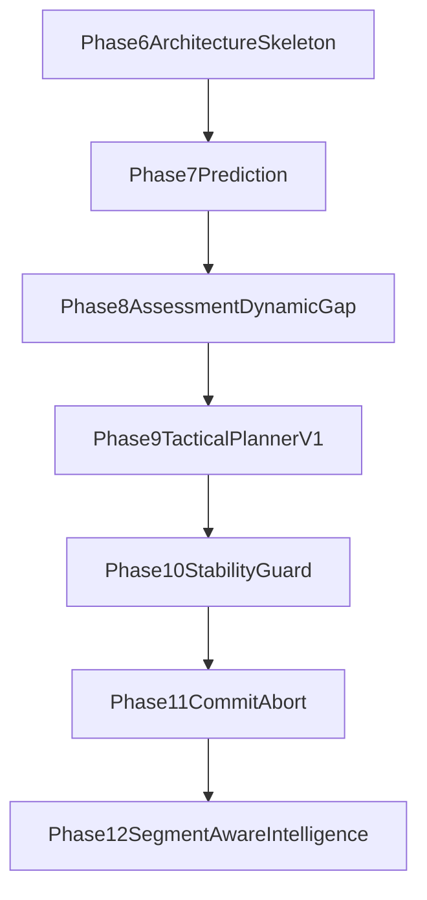

# Phase 6-12: Master Rollout Plan

This document orchestrates Phase 6 through Phase 12 as a single implementation and validation chain after Phase 5 completion.

It is derived from:

- `src/scenic/domains/racing/restrcture_plan.md` (architecture intent)
- `src/scenic/domains/racing/phase6-12.md` (phase-specific execution guidance)

## Current rollout checkpoint

- Phase 6: implemented shell/observability baseline.
- Phase 7: complete (next-step prediction baseline).
- Phase 8: complete (stateful assessment + dynamic gap baseline).
- Phase 9: complete as tactical baseline (setup/follow/opening logic).
- Phase 10: complete as stability baseline (guard + emergency containment).
- Phase 11: implemented (initial commit/abort slice; validation pending).
- Phase 12: planned and not yet implemented.

## Scope and assumptions

- Scope remains **single dynamic opponent** plus ego.
- Pitlane redesign remains out of scope.
- Existing MPC executor remains active during migration; extraction is incremental.
- Fellow behavior assumptions are constrained to scriptable primitives:
  - `TTL_CRUISE`
  - `TTL_SUDDEN_STOP`
  - `TTL_SWERVE_OUT_OF_CONTROL`

## Canonical tactical vocabulary (Phases 6-12)

Planner states:

- `FREE_RUN`
- `FOLLOW`
- `SETUP_PASS_LEFT`
- `SETUP_PASS_RIGHT`
- `COMMIT_PASS_LEFT`
- `COMMIT_PASS_RIGHT`
- `ABORT_PASS`
- `EMERGENCY_STABLE`

Guard vocabulary:

- `guard_active`
- `guard_reason`
- `steer_limited`
- `brake_limited`
- `ttl_switch_blocked`
- `emergency_stable_mode`

## Shared scenario bank contract

All phases 6-12 use scenario IDs rooted in the same reusable intent bank:

- `F0` ego alone baseline
- `F1` fellow behind, same TTL, cruise
- `F2` fellow ahead, same TTL, slower, cruise
- `F3L` fellow ahead on left TTL, cruise
- `F3R` fellow ahead on right TTL, cruise
- `F4` fellow ahead then sudden stop
- `F5` fellow ahead then out-of-control swerve and stop
- `F6` fellow ahead on left TTL, deterministic occupancy
- `F7` fellow ahead on right TTL, deterministic occupancy
- `F8` corner-entry stress with fellow ahead on optimal

Canonical shared bank location:

- `examples/racing/f_shared/`
- shared naming map: `src/scenic/domains/racing/benchmarks/f_scenario_bank.py`

Each scenario definition should record:

- fellow script
- fellow TTL
- fellow speed profile
- initial longitudinal gap
- segment context

## Cross-phase telemetry contract

From Phase 6 onward, logs should keep a stable and extendable schema:

- planner state, chosen TTL, target speed cap, decision reason
- ego and fellow speed/progress
- actual gap and safe gap
- corridor openness (`optimal_open`, `left_open`, `right_open`)
- predictor outputs and prediction error (when available)
- guard activations and reasons
- collision / off-track / forced-stop outcomes

## Phase dependency graph

## Entry and exit gates

### Entering Phase 6

- Phase 5 safety envelope remains accepted baseline.
- Existing phase runners and digest parsing are healthy.

### Exiting each phase

Every phase must show:

1. Explicit feature completeness in code and docs.
2. Observable log-level evidence for new decisions.
3. Safety non-regression relative to prior phase.
4. Repeatable scenario outcomes on defined bank subset.

### Entering next phase

- Prior phase exit checklist completed.
- New telemetry fields parsed or at least present in per-scenario logs.
- Known caveats documented (not hidden in run output only).

## Artifact matrix by phase

| Phase | Primary capability | Primary modules (target) | Bench focus |
|------|---------------------|--------------------------|-------------|
| 6 | Layered skeleton + orchestration wiring | `src/scenic/domains/racing/behaviors.scenic`, `src/scenic/domains/racing/phase6_runtime.py` | `F0`, `F1`, `F2` |
| 7 | Fellow next-step predictor | `src/scenic/domains/racing/prediction/fellow_predictor.py` | `F2`, `F4`, `F5`, `F6`, `F7` |
| 8 | Situation assessment + dynamic safe gap | `src/scenic/domains/racing/assessment/race_situation.py` | `F1`, `F2`, `F4`, `F6`, `F7` |
| 9 | Tactical planner v1 | `src/scenic/domains/racing/tactical_planner.py` | `F0`, `F1`, `F2`, `F6`, `F7` |
| 10 | Stability guard and anti-swerve policy | `src/scenic/domains/racing/safety/stability_guard.py` | `F4`, `F5`, tight-gap `F2`, aggressive `F6`/`F7` |
| 11 | Commit/abort pass lifecycle | `src/scenic/domains/racing/tactical_planner.py` + pass lifecycle helpers | `F2`, `F4`, `F5`, `F6`, `F7` |
| 12 | Segment-aware tactical intelligence | planner + segment context integration | Straight vs corner-entry variants of `F2`/`F6`/`F7`, plus `F5` near corner entry |

## Migration guidance (no big-bang rewrite)

Adopt extraction sequence:

1. Wire top-level orchestration shell and stable per-cycle logging.
2. Add prediction and verify with explicit error metrics.
3. Add assessment facts and dynamic gap without changing pass semantics.
4. Enable planner state transitions with setup-pass decisions.
5. Add guard enforcement and emergency stability constraints.
6. Add commit/abort lifecycle transitions.
7. Add segment-conditioned tactical modifiers.

At every step, keep low-level MPC executor as a stable sink for chosen references until replacements are validated.

## Risk register (cross-phase)

- **Fixed-meter safety thresholds:** follow and proximity rules must scale with speed
  (time-headway style: `distance ≥ max(floor_m, τ · speed)`), not “magic constant”
  meters only. Phase 8 makes this explicit (`safe_gap`); Phase 6–7 interim caps should
  use the same principle so faster ego demands larger clearance.
  - Mitigation: shared helpers (e.g. headway distance in `phase6_runtime.py`) and
    review any new `<= N` meter cutoffs in planner/guard code.
- **Integration drift:** layers exist but are bypassed at runtime.
  - Mitigation: explicit per-cycle layer-call logs in Phase 6 and CI checks.
- **Decision chatter:** state flips from noisy labels.
  - Mitigation: hysteresis/cooldowns in planner and guard.
- **Prediction overconfidence:** forecast used without error monitoring.
  - Mitigation: keep prediction-error telemetry as gate from Phase 7 onward.
- **Safety-policy mismatch:** guard too weak or too strict.
  - Mitigation: define measurable guard metrics in Phase 10.
- **Segment boundary artifacts:** abrupt tactical changes at map transitions.
  - Mitigation: Phase 12 comparison runs across straight vs corner-entry variants.

## Planned phase documents

- [Phase 6: Architecture skeleton and observability](./phase-6-architecture-skeleton-and-observability.md)
- [Phase 7: Fellow next-step prediction](./phase-7-fellow-next-step-prediction.md)
- [Phase 8: Situation assessment and dynamic gap](./phase-8-situation-assessment-and-dynamic-gap.md)
- [Phase 9: Tactical planner v1](./phase-9-tactical-planner-v1.md)
- [Phase 10: Stability guard and emergency policy](./phase-10-stability-guard-and-emergency-policy.md)
- [Phase 11: Pass commit and abort](./phase-11-pass-commit-and-abort.md)
- [Phase 12: Segment-aware tactical intelligence](./phase-12-segment-aware-tactical-intelligence.md)

## Definition of success for the 6-12 program

The stack is considered successful when it can:

- interpret simple scripted fellow behavior correctly and consistently,
- produce stable and explainable tactical decisions,
- pass deterministically in cruise opportunities (`F6`/`F7` patterns),
- abort safely in disruption cases (`F4`/`F5` patterns),
- improve timing quality with segment context while preserving safety.
